# Telegram Bot Integration: Cost-Benefit Analysis

This document provides a comprehensive analysis of implementation costs, operational overhead, and return on investment for the Telegram Bot Integration epic, with deep focus on the weekly quiz feature and its interconnected requirements.

---

## Executive Summary

**Key Finding**: The weekly quiz feature drives significant complexity that transforms this from a "simple bot" into a comprehensive community management platform. The ROI depends heavily on whether community engagement justifies the substantial infrastructure investment.

**Recommendation Framework**: Three implementation approaches with different cost-benefit profiles for strategic consideration.

---

## 1. Weekly Quiz Ecosystem Deep Analysis

### 1.1 Feature Complexity Mapping

The weekly quiz isn't just "send questions to groups" - it requires a comprehensive ecosystem:

```mermaid
graph TD
    A[Weekly Quiz Feature] --> B[Content Management System]
    A --> C[Scheduling & Distribution Engine]
    A --> D[Community Management Platform]
    A --> E[Analytics & Reporting Dashboard]
    
    B --> B1[Question Creation Interface]
    B --> B2[Content Approval Workflow]
    B --> B3[Multi-language Management]
    B --> B4[Version Control System]
    
    C --> C1[Time Zone Handling]
    C --> C2[Multi-Channel Distribution]
    C --> C3[Automated Scheduling]
    C --> C4[Federation-Specific Customization]
    
    D --> D1[Channel Creation & Management]
    D --> D2[Moderation Tools]
    D --> D3[User Permission Systems]
    D --> D4[Spam Prevention]
    D --> D5[Discussion Threading]
    
    E --> E1[Participation Tracking]
    E --> E2[Educational Effectiveness Metrics]
    E --> E3[Leaderboards & Recognition]
    E --> E4[Federation Reporting]
```

### 1.2 Infrastructure Dependencies Created

**Administrative Platform Requirements**:
- Federation admin dashboard for content management
- Quiz creation and curation interface with preview capabilities
- Scheduling system with time zone management
- User and channel management interface
- Analytics dashboard with educational insights
- Moderation tools and community oversight features

**Backend System Requirements**:
- Scheduled delivery system with reliability guarantees
- Multi-channel message distribution with targeting
- Real-time analytics processing and aggregation
- Content approval workflow engine
- User permission and access control system
- Community engagement tracking and gamification

**Integration Complexity**:
- Deep integration with existing quiz database and question management
- Cross-platform analytics correlation (web + Telegram usage)
- Multi-language content management and delivery
- Federation-specific customization and branding
- Community moderation integration with existing admin tools

---

## 2. Implementation Cost Deep-Dive

### 2.1 Development Effort Analysis

**Phase 1: Core Bot Infrastructure (4-6 weeks)**
- Basic Telegram Bot API integration: 1-2 weeks
- Rule lookup and Q&A functionality: 1-2 weeks  
- Database integration and basic analytics: 1 week
- Testing and deployment infrastructure: 1 week

**Phase 2: Weekly Quiz Foundation (6-8 weeks)**
- Content management system development: 2-3 weeks
- Scheduling and distribution engine: 2 weeks
- Basic analytics and reporting: 1-2 weeks
- Admin interface for federation coordinators: 2-3 weeks

**Phase 3: Community Management Platform (8-12 weeks)**
- Channel management and moderation tools: 3-4 weeks
- Advanced analytics and leaderboards: 2-3 weeks
- Social features and discussion threading: 2-3 weeks
- Multi-language support and localization: 2-3 weeks

**Total Estimated Development**: 18-26 weeks (4.5-6.5 months)

### 2.2 Infrastructure Costs

**Development Infrastructure**:
- Additional server capacity for bot processing: $50-100/month
- Telegram Bot API usage (free tier likely sufficient initially)
- Development and staging environments: $30-50/month
- Analytics and monitoring tools: $20-40/month

**Production Infrastructure**:
- Auto-scaling bot servers for community growth: $100-500/month
- Database scaling for analytics and community data: $50-200/month
- CDN and asset delivery for rich content: $20-50/month
- Backup and disaster recovery: $30-60/month

**Estimated Monthly Infrastructure**: $200-800 (scales with community size)

### 2.3 Integration Complexity Assessment

**High Complexity Areas**:
- **Community Management**: Requires sophisticated moderation, user management, and social features
- **Multi-Federation Support**: Different federations need customized experiences and branding
- **Analytics Integration**: Complex correlation between web platform and Telegram usage
- **Content Workflow**: Approval processes and quality control require workflow management

**Medium Complexity Areas**:
- **Scheduling System**: Time zone handling and automated delivery
- **Basic Analytics**: Participation tracking and educational metrics
- **Admin Interface**: Federation coordinator tools and dashboards

**Low Complexity Areas**:
- **Basic Bot Functions**: Rule lookup and simple Q&A
- **Database Integration**: Leveraging existing quiz infrastructure
- **Simple Analytics**: Basic usage metrics and reporting

---

## 3. Operational Cost Analysis

### 3.1 Federation Management Overhead

**Content Curation Requirements**:
- Weekly quiz question creation and review: 2-4 hours/week per federation
- Content quality control and educational alignment: 1-2 hours/week
- Multi-language content management: 2-3 hours/week (if supported)
- Community moderation and user support: 3-5 hours/week

**Training and Support Requirements**:
- Federation coordinator onboarding: 4-8 hours per federation
- Ongoing training for new features: 2-3 hours/quarter
- Technical support for admin tools: 1-2 hours/week
- Community management best practices: Ongoing consultation

**Estimated Federation Overhead**: 8-15 hours/week per active federation

### 3.2 Platform Maintenance Overhead

**Community Management**:
- Content moderation and spam prevention: 5-10 hours/week
- User support and technical assistance: 3-5 hours/week
- Community engagement and growth initiatives: 2-4 hours/week

**Technical Maintenance**:
- Infrastructure monitoring and scaling: 2-3 hours/week
- Feature updates and bug fixes: 4-6 hours/week
- Analytics processing and reporting: 1-2 hours/week
- Security monitoring and compliance: 1-2 hours/week

**Estimated Platform Overhead**: 15-30 hours/week

### 3.3 Scaling Considerations

**Community Growth Implications**:
- Linear growth in content moderation needs
- Exponential growth in user support requests during issues
- Infrastructure costs scale with active user count
- Federation management overhead grows with each new region

**Breaking Points**:
- **1,000 active users**: Manual moderation becomes challenging
- **5,000 active users**: Infrastructure costs become significant
- **10+ federations**: Management overhead requires dedicated resources
- **Multiple languages**: Content management complexity multiplies

---

## 4. Value Creation & ROI Assessment

### 4.1 Direct Value Quantification

**User Acquisition & Retention**:
- Weekly quiz provides recurring engagement touchpoint
- Community features increase platform stickiness
- Educational value drives word-of-mouth growth
- **Estimated Impact**: 30-50% higher user retention vs. basic bot

**Educational Effectiveness**:
- Structured learning through weekly engagement
- Community discussion amplifies individual learning
- Analytics provide insights for content improvement
- **Estimated Impact**: 25-40% improvement in rule knowledge retention

**Federation Engagement**:
- Direct connection to Ultimate community
- Data insights for educational planning
- Platform for community building and outreach
- **Estimated Impact**: 3-5x higher federation coordinator satisfaction

### 4.2 Strategic Value Assessment

**First-Mover Advantage**:
- No existing digital Ultimate rules platform with community features
- Opportunity to become the global standard for Ultimate education
- Platform positioning for future features and monetization

**Network Effects**:
- Weekly quiz drives adoption of other bot features
- Community engagement creates viral growth potential
- Federation success stories drive additional federation adoption
- Cross-pollination between different Ultimate communities

**Platform Differentiation**:
- Transforms Regelator from reference tool to learning community
- Creates defensible moat through community engagement
- Provides rich data for continuous improvement

### 4.3 ROI Framework Analysis

**Investment Required**:
- Development: 18-26 weeks ($45k-65k equivalent effort)
- Infrastructure: $200-800/month ongoing
- Operational: 15-30 hours/week management overhead

**Value Creation Potential**:
- User base growth: 5-10x vs. basic rule lookup
- Community engagement: Recurring weekly touchpoints
- Educational impact: Measurable learning improvement
- Strategic positioning: Platform leadership in Ultimate education

**Break-Even Analysis**:
- Need 2,000+ engaged weekly quiz participants to justify infrastructure
- Need 3+ active federations to justify management overhead
- Need measurable educational improvement to justify strategic investment

---

## 5. Risk Analysis

### 5.1 Technical Risks

**High Risk**:
- **Community Management Complexity**: Moderation at scale is difficult and expensive
- **Multi-Federation Requirements**: Different needs create feature complexity
- **Telegram Platform Dependency**: Limited control over core platform changes

**Medium Risk**:
- **Analytics Integration**: Complex correlation between platforms
- **Scaling Infrastructure**: Community growth may outpace infrastructure planning
- **Content Management**: Workflow complexity for multiple languages/regions

**Low Risk**:
- **Basic Bot Functionality**: Well-established patterns and APIs
- **Database Integration**: Leveraging existing Regelator infrastructure
- **Simple Features**: Rule lookup and Q&A have clear implementation paths

### 5.2 Operational Risks

**High Risk**:
- **Content Quality Control**: Poor quiz questions damage educational credibility
- **Community Moderation**: Toxic behavior can destroy community value
- **Federation Coordinator Burnout**: High management overhead may lead to abandonment

**Medium Risk**:
- **User Support Scaling**: Growth may outpace support capacity
- **Feature Complexity Creep**: Community requests may drive unsustainable complexity
- **Multi-Language Quality**: Translation quality affects user experience

### 5.3 Strategic Risks

**High Risk**:
- **ROI Uncertainty**: Community engagement is difficult to predict
- **Opportunity Cost**: Resources could be invested in web platform improvements
- **Market Validation**: Unclear if Ultimate community wants social learning features

**Medium Risk**:
- **Competitive Response**: Other platforms may copy successful features
- **Federation Politics**: Different regions may have conflicting requirements
- **User Adoption**: Mobile-first users may not engage with community features

---

## 6. Alternative Implementation Approaches

### 6.1 Approach A: Full Community Platform

**Features**:
- Complete weekly quiz with community management
- Advanced analytics and federation tools
- Social features and gamification
- Multi-language and multi-federation support

**Investment**: 18-26 weeks development, $500-800/month infrastructure, 25-30 hours/week operations
**Value Potential**: High - transforms Ultimate learning ecosystem
**Risk Level**: High - significant investment with uncertain ROI

### 6.2 Approach B: MVP Community Bot

**Features**:
- Basic weekly quiz without advanced social features
- Simple analytics and federation tools
- Limited community management
- Single language, single federation initially

**Investment**: 8-12 weeks development, $200-300/month infrastructure, 10-15 hours/week operations
**Value Potential**: Medium - proves community engagement concept
**Risk Level**: Medium - manageable investment with learning opportunity

### 6.3 Approach C: Individual-Focused Bot

**Features**:
- Personal rule lookup and Q&A
- Individual quiz and learning features
- Basic analytics for educational insights
- No community or social features

**Investment**: 4-6 weeks development, $100-200/month infrastructure, 5-8 hours/week operations
**Value Potential**: Low-Medium - solves individual pain points only
**Risk Level**: Low - clear value with minimal complexity

---

## 7. Decision Framework & Recommendations

### 7.1 Strategic Decision Criteria

**Go/No-Go Thresholds**:

**GREEN LIGHT** (Approach A or B):
- ✅ 3+ federations committed to weekly quiz participation
- ✅ 1,000+ Ultimate players engaged with existing Regelator
- ✅ Dedicated resources for 25+ hours/week community management
- ✅ Federation coordinators committed to content creation workflow

**YELLOW LIGHT** (Approach B or C):
- ⚠️ 1-2 federations interested but not committed
- ⚠️ 500+ Ultimate players using existing platform
- ⚠️ Limited resources for community management
- ⚠️ Uncertain federation coordinator engagement

**RED LIGHT** (Do not proceed):
- ❌ No federation coordinator engagement
- ❌ Limited existing user base for validation
- ❌ No resources for ongoing community management
- ❌ Higher priority opportunities available

### 7.2 Recommended Approach

**Primary Recommendation: Approach B (MVP Community Bot)**

**Rationale**:
- Validates community engagement concept with manageable investment
- Provides learning opportunity before full platform commitment
- Allows iteration based on actual federation and user feedback
- Creates foundation for scaling to Approach A if successful

**Implementation Strategy**:
1. **Phase 1** (6 weeks): Basic bot with simple weekly quiz for single federation
2. **Phase 2** (4 weeks): Basic analytics and admin interface
3. **Phase 3** (2 weeks): Refine based on usage data and feedback
4. **Decision Point**: Evaluate success metrics and decide on Approach A investment

**Success Metrics for MVP**:
- 100+ weekly quiz participants within 3 months
- 70%+ weekly participation retention rate
- 1+ additional federation requesting access
- Positive educational impact measurement

### 7.3 Alternative Recommendation

**If Risk Tolerance is Low: Approach C (Individual-Focused Bot)**

**Rationale**:
- Delivers immediate value with minimal complexity
- Validates basic bot functionality and user adoption
- Creates foundation for future community features
- Preserves resources for web platform development

**Success Criteria for Upgrade**:
- 500+ daily active bot users within 6 months
- Clear user demand for community features
- Federation coordinator engagement demonstrated
- Available resources for community management

---

## 8. Conclusion

The Telegram Bot Integration presents a significant opportunity to transform Ultimate Frisbee rule education, but the weekly quiz feature creates substantial complexity that must be carefully managed.

**Key Insights**:

1. **Weekly Quiz ≠ Simple Feature**: It requires a comprehensive community management platform
2. **ROI Depends on Community Engagement**: Success hinges on sustained federation and user participation
3. **Operational Overhead is Significant**: 15-30 hours/week ongoing management required
4. **Value Potential is High**: Could establish Regelator as the global Ultimate education platform

**Strategic Recommendation**: 
Proceed with **Approach B (MVP Community Bot)** to validate community engagement with manageable risk and investment. This provides learning opportunity while preserving option to scale to full community platform if successful.

**Critical Success Factors**:
- Federation coordinator commitment to content creation
- Dedicated resources for community management
- Clear success metrics and decision points
- Willingness to iterate based on user feedback

---

## 9. Additional Feature Analysis

The weekly quiz was analyzed in depth above, but three other core features were proposed. Each has different cost-benefit profiles and strategic implications.

### 9.1 Individual Tailored Quiz Scheduling (Flash Cards Style)

**Feature Description**: Personalized learning system that sends customized quiz questions to individual users based on their learning progress, using spaced repetition algorithms for optimal knowledge retention.

**Implementation Complexity: Medium-High**

**Development Requirements** (4-6 weeks):
- User profile and learning state management system
- Spaced repetition algorithm implementation (e.g., SM-2 or Anki-style)
- Personalized scheduling engine with notification system
- Progress tracking and analytics per individual user
- Integration with existing quiz database and question tagging

**Infrastructure Costs**:
- Individual user data storage and processing: $50-150/month
- Scheduling system and notification delivery: $30-80/month
- Analytics processing for personal learning metrics: $20-50/month

**Operational Overhead**: 3-5 hours/week
- Algorithm tuning and learning effectiveness monitoring
- User support for personalization features
- Content tagging and difficulty calibration

**Value Proposition**:
- **High Individual Value**: Transforms random learning into scientifically-optimized education
- **Retention Benefits**: Spaced repetition significantly improves long-term knowledge retention
- **Personalization Appeal**: Each user gets customized experience based on their knowledge gaps
- **Habit Formation**: Regular, personally relevant notifications build consistent engagement

**Unique Risks**:
- Privacy concerns with individual learning data storage
- Algorithm complexity may lead to poor user experience if not tuned correctly
- Requires significant user data to be effective (cold start problem)

**ROI Assessment**: High value for engaged users, moderate implementation cost. Strong candidate for MVP inclusion due to individual value without community management complexity.

### 9.2 Rule Searching (Keyword and Semantic)

**Feature Description**: Advanced search functionality that allows users to find specific rules using both exact keyword matching and semantic/conceptual queries (e.g., "what happens when disc goes out of bounds").

**Implementation Complexity: Medium**

**Development Requirements** (3-4 weeks):
- Search indexing system for rule content and metadata
- Keyword matching with fuzzy search and typo tolerance
- Semantic search using embeddings or NLP techniques
- Command interface design (`/rule`, `/search` commands)
- Result ranking and presentation optimization

**Infrastructure Costs**:
- Search indexing and query processing: $30-60/month
- Semantic search compute (if using external APIs): $50-200/month
- Result caching and optimization: $20-40/month

**Operational Overhead**: 1-2 hours/week
- Search result quality monitoring and tuning
- Synonym and terminology management
- Query pattern analysis for improvements

**Value Proposition**:
- **Immediate Utility**: Solves core user pain point of finding specific rules quickly
- **Mobile Optimization**: Voice and text queries work well on mobile devices
- **Low Learning Curve**: Users understand search intuitively
- **Broad Appeal**: Valuable for both new and experienced players

**Implementation Variations**:
- **Basic Keyword**: Simple text matching (low cost, good baseline value)
- **Fuzzy Matching**: Handles typos and partial matches (medium cost, better UX)
- **Semantic Search**: Understands intent and context (high cost, best UX)

**ROI Assessment**: Very high value-to-cost ratio. Essential feature for MVP due to solving fundamental access problem with manageable complexity.

### 9.3 RAG-Based Rules Q&A System

**Feature Description**: AI-powered conversational system that can answer complex questions about Ultimate Frisbee rules using natural language, providing contextual explanations and handling nuanced scenarios.

**Implementation Complexity: High**

**Development Requirements** (8-12 weeks):
- RAG (Retrieval-Augmented Generation) system architecture
- Rule knowledge base preparation and vectorization
- LLM integration and prompt engineering for Ultimate Frisbee domain
- Response quality control and fact-checking systems
- Conversation context management and multi-turn dialogues
- Fallback mechanisms for uncertain responses

**Infrastructure Costs**:
- LLM API usage (GPT-4/Claude): $200-800/month depending on usage
- Vector database and embedding storage: $50-100/month
- Response processing and caching: $30-60/month
- Quality monitoring and logging: $20-40/month

**Operational Overhead**: 5-10 hours/week
- Response quality monitoring and correction
- Prompt engineering and system tuning
- Handling edge cases and incorrect responses
- Domain knowledge updates and system training

**Value Proposition**:
- **Transformational UX**: Natural language interaction eliminates need to know rule structure
- **Complex Scenario Handling**: Can interpret multi-rule situations and edge cases
- **Educational Value**: Provides explanations and context, not just rule citations
- **Accessibility**: Lowers barrier for new players to understand complex rules

**Unique Challenges**:
- **Accuracy Critical**: Wrong rule interpretations could affect game outcomes
- **Domain Expertise Required**: Needs deep understanding of Ultimate Frisbee rules and culture
- **Cost Scaling**: LLM costs grow with user adoption and query complexity
- **Liability Concerns**: AI-generated rule interpretations may create responsibility issues

**ROI Assessment**: Highest potential user value but also highest risk and cost. Better suited for later phases after core functionality proven.

### 9.4 Feature Interaction and Synergy Analysis

**Complementary Relationships**:
- **Search + RAG Q&A**: Search provides quick lookups, RAG handles complex questions
- **Individual Quiz + Search**: Quiz identifies knowledge gaps, search helps fill them
- **Weekly Quiz + Individual Quiz**: Community engagement drives individual learning
- **RAG Q&A + Weekly Quiz**: AI explanations enhance community discussions

**Implementation Dependencies**:
- All features require robust rule database integration
- Search indexing supports both search and RAG retrieval
- User management system supports both individual and community features
- Analytics infrastructure serves all features

**MVP Combinations**:
1. **Search + Individual Quiz**: High individual value, manageable complexity
2. **Search + Weekly Quiz**: Combines individual utility with community engagement
3. **All Features Except RAG**: Comprehensive platform without AI complexity

---

## 10. Revised Feature Prioritization Matrix

### 10.1 Value vs. Cost Analysis

| Feature | User Value | Implementation Cost | Operational Cost | Risk Level | MVP Priority |
|---------|------------|-------------------|------------------|------------|--------------|
| Rule Search (Basic) | High | Low | Low | Low | **Essential** |
| Individual Quiz | High | Medium | Low | Low | **High** |
| Weekly Quiz | Medium-High | High | High | Medium | **Medium** |
| Rule Search (Semantic) | High | Medium | Medium | Medium | **Medium** |
| RAG Q&A | Very High | Very High | High | High | **Low** |

### 10.2 Revised Implementation Approaches

**Approach A: Individual-Focused MVP** (Recommended)
- **Features**: Basic rule search + Individual tailored quizzes
- **Investment**: 7-10 weeks development, $150-300/month infrastructure
- **Value**: Solves core individual pain points with manageable complexity
- **Risk**: Low - clear user value with minimal operational overhead

**Approach B: Community-Enhanced Platform**
- **Features**: Search + Individual quiz + Weekly quiz (simplified)
- **Investment**: 12-16 weeks development, $300-500/month infrastructure
- **Value**: Combines individual utility with community engagement
- **Risk**: Medium - adds community management complexity

**Approach C: Advanced AI Platform**
- **Features**: All features including semantic search and RAG Q&A
- **Investment**: 20-28 weeks development, $500-1000/month infrastructure
- **Value**: Revolutionary user experience with comprehensive capabilities
- **Risk**: High - significant complexity and cost with uncertain adoption

### 10.3 Updated Recommendations

**Primary Recommendation: Approach A (Individual-Focused MVP)**

**Rationale**:
- **Search** solves the fundamental access problem that drives all user stories
- **Individual Quiz** provides personalized learning without community management overhead
- **Manageable Investment** allows validation of bot concept with minimal risk
- **Clear Value Path** from individual utility to potential community features

**Success Metrics for Approach A**:
- 500+ daily search queries within 3 months
- 200+ users with active individual quiz schedules
- 70%+ user satisfaction with search result relevance
- 40%+ improvement in individual rule knowledge (measured via quiz performance)

**Upgrade Criteria to Approach B**:
- Strong individual feature adoption demonstrated
- Federation coordinator interest in weekly quiz confirmed
- Community management resources available
- User demand for social/community features evident

---

## 11. Final Strategic Recommendation

**Proceed with Approach A (Individual-Focused MVP)** focusing on rule search and individual tailored quizzes as the optimal balance of value, cost, and risk.

**Implementation Sequence**:
1. **Phase 1** (4 weeks): Basic rule search with keyword matching
2. **Phase 2** (3 weeks): Individual quiz scheduling with basic spaced repetition
3. **Phase 3** (2 weeks): Analytics and user feedback collection
4. **Phase 4** (2 weeks): Polish and optimization based on usage patterns

**Decision Points**:
- After Phase 3: Evaluate user adoption and satisfaction metrics
- If successful: Consider semantic search enhancement
- If very successful: Evaluate weekly quiz addition (Approach B)
- If exceptional: Plan RAG Q&A development (Approach C)

The decision ultimately depends on strategic priorities: start with proven individual value and expand based on demonstrated success, rather than betting on complex community features from the beginning.