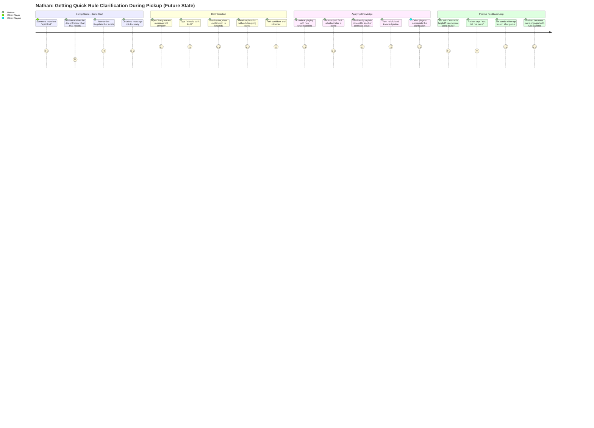
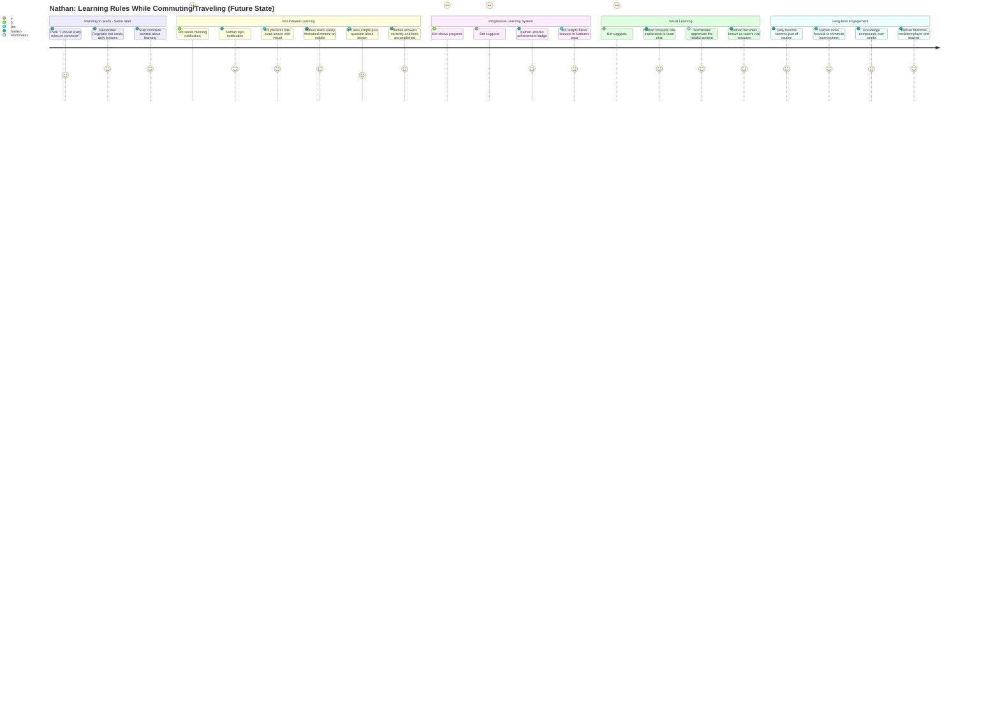
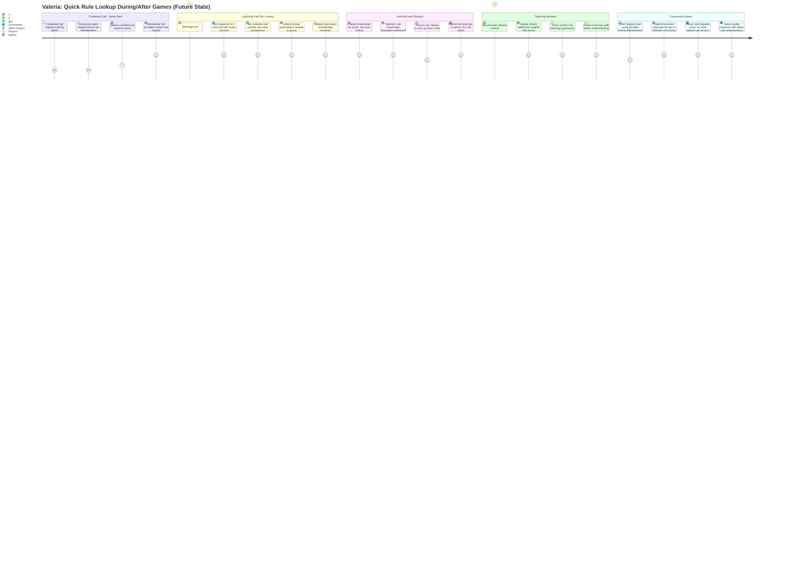
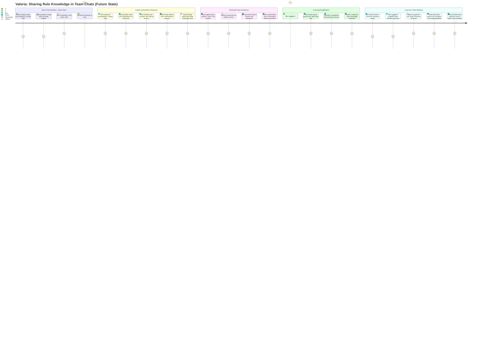

# Telegram Bot Future State - Perfect World User Journeys

This document shows how the Telegram Bot transforms each painful scenario from the current state into delightful, empowering experiences. Each journey starts identically to the now map, then diverges when the bot enters to create transformational outcomes with high satisfaction scores (1=terrible, 5=amazing).

---

## Nathan (New Player) - Transformed Learning Journeys

### Story 1: Getting Quick Rule Clarification During Pickup

**Context**: Nathan needs quick rule clarification during pickup games when someone mentions terms like "spirit foul" or "bid."

**Transformational Improvements**:
- **Private, instant access** eliminates social embarrassment (score: 5)
- **Real-time learning** without game disruption (score: 5)
- **Confidence building** leads to helping others (score: 5)
- **Proactive follow-up** creates learning momentum (score: 4-5)
- **Social amplification** as Nathan helps other confused players

---

### Story 2: Learning Rules While Commuting/Traveling

**Context**: Nathan wants to use commute time to learn Ultimate rules but previously had no practical way to access them.

**Transformational Improvements**:
- **Proactive learning system** eliminates remembering burden (score: 5)
- **Mobile-optimized content** makes learning effortless (score: 5)
- **Progress tracking and gamification** create motivation (score: 5)
- **Social sharing features** position Nathan as helpful teammate (score: 5)
- **Habit formation** through consistent, enjoyable experiences (score: 5)

---

### Story 3: Asking Embarrassing Questions Privately

**Context**: Nathan realizes he doesn't understand basic concepts after playing for weeks but is too embarrassed to ask teammates.

**Transformational Improvements**:
- **Judgment-free environment** eliminates learning barriers (score: 5)
- **Immediate, authoritative answers** build confidence (score: 5)  
- **Reassurance about question commonality** reduces shame (score: 5)
- **Progressive confidence building** turns Nathan into teacher (score: 5)
- **Community connection** creates support network (score: 5)

---

## Valeria (Experienced Player) - Transformed Speed & Context Journeys

### Story 4: Quick Rule Lookup During/After Games

**Context**: Valeria needs to quickly verify edge case rules during heated discussions after contested calls.

**Transformational Improvements**:
- **Instant rule verification** maintains discussion momentum (score: 5)
- **Authoritative source** settles disputes definitively (score: 5)
- **Enhanced reputation** positions Valeria as rule expert (score: 5)
- **Teaching opportunities** turn conflicts into learning (score: 5)
- **Community improvement** as bot adoption spreads (score: 5)

---

### Story 5: Sharing Rule Knowledge in Team Chats

**Context**: When newer teammates ask rule questions in team group chat, Valeria wants to share accurate rule information quickly.

**Transformational Improvements**:
- **Zero context switching** keeps conversation flow intact (score: 5)
- **Immediate authoritative sharing** enhances Valeria's mentorship (score: 5)
- **Team-wide learning** amplifies individual questions (score: 5)
- **Social learning features** build team engagement (score: 5)
- **Long-term team development** through analytics and suggestions (score: 5)

---

### Story 6: Testing Knowledge On-the-Go

**Context**: Valeria wants to test her edge case rule knowledge while traveling to tournaments.

**Transformational Improvements**:
- **Proactive practice suggestions** optimize preparation timing (score: 5)
- **Mobile-optimized interface** makes travel learning effortless (score: 5)
- **Adaptive difficulty** provides personalized challenge (score: 5)
- **Social sharing** amplifies individual learning to team benefit (score: 5)
- **Real-world application** improves tournament performance (score: 5)

---

## Fred (Federation Coordinator) - Transformed Monitoring & Reach Journeys

### Story 7: Understanding How Players Learn Rules

**Context**: Fred wants to understand which rules players find confusing but previously had no way to gather learning data.

**Transformational Improvements**:
- **Real usage analytics** provide unprecedented learning insights (score: 5)
- **Data-driven content planning** maximizes educational impact (score: 5)
- **Real-time feedback loops** enable rapid iteration (score: 5)
- **Community impact measurement** proves educational value (score: 5)
- **Continuous improvement** creates virtuous learning cycle (score: 5)

---

### Story 8: Reaching Players Where They Already Are

**Context**: Fred wants to distribute educational content to the Ultimate community but previously relied on channels with low engagement.

**Transformational Improvements**:
- **Direct push to engaged users** eliminates discovery barriers (score: 5)
- **Social amplification** leverages existing player networks (score: 5)
- **Interactive education** enables real-time clarification (score: 5)
- **Global reach** expands impact beyond local federation (score: 5)
- **Measurable effectiveness** proves educational value (score: 5)

---

### Story 9: Distributing Educational Content at Scale

**Context**: When new rule interpretations come out, Fred needs to educate the community quickly.

**Transformational Improvements**:
- **Instant global distribution** eliminates communication delays (score: 5)
- **Personalized delivery** ensures relevant players get targeted info (score: 5)
- **Interactive education** confirms understanding before tournaments (score: 5)
- **Real-time feedback** enables rapid content refinement (score: 5)
- **Systemic improvement** creates lasting educational advancement (score: 5)

---

## Summary of Transformational Value

### Cross-Persona Impact Amplification

**Individual Success → Community Benefit**:
- Nathan's private learning → confident teaching → team knowledge improvement
- Valeria's quick lookups → resolved disputes → better game quality
- Fred's analytics → targeted education → global rule understanding

**Positive Feedback Loops**:
- More bot usage → better AI → more accurate responses → higher satisfaction
- Educational success → community adoption → network effects → platform value
- Data insights → content improvement → learning effectiveness → community growth

**Social Network Effects**:
- Team chat integration amplifies individual learning to group benefit
- Viral content sharing extends educational reach exponentially  
- Cross-community knowledge transfer improves global Ultimate quality

### Revolutionary Improvements by Category

**Accessibility Revolution**:
- From impossible PDF access → instant, mobile-native rule lookup (1 → 5)
- From embarrassing public questions → private, judgment-free learning (1 → 5)
- From manual rule hunting → proactive, personalized education (1 → 5)

**Social Learning Transformation**:
- From isolated confusion → connected learning communities (1 → 5)
- From memory-based disputes → authoritative resolution (1 → 5) 
- From educational content waste → engaged, interactive learning (1 → 5)

**Operational Excellence**:
- From zero analytics → rich learning insights for evidence-based decisions (1 → 5)
- From slow formal channels → instant, targeted educational campaigns (1 → 5)
- From local impact → global educational transformation (2 → 5)

**Technology-Enabled Empowerment**:
- From knowledge barriers → confidence building and teaching capability (1 → 5)
- From fragmented learning → systematic, progressive skill development (1 → 5)
- From individual struggles → community-wide capability advancement (1 → 5)

The Telegram bot doesn't just solve current problems—it creates a fundamentally transformed Ultimate Frisbee learning ecosystem where rule knowledge becomes accessible, social, engaging, and continuously improving for the global community.