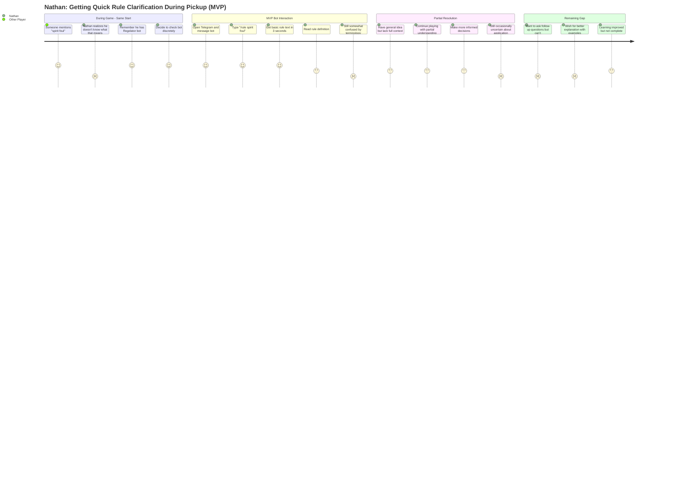
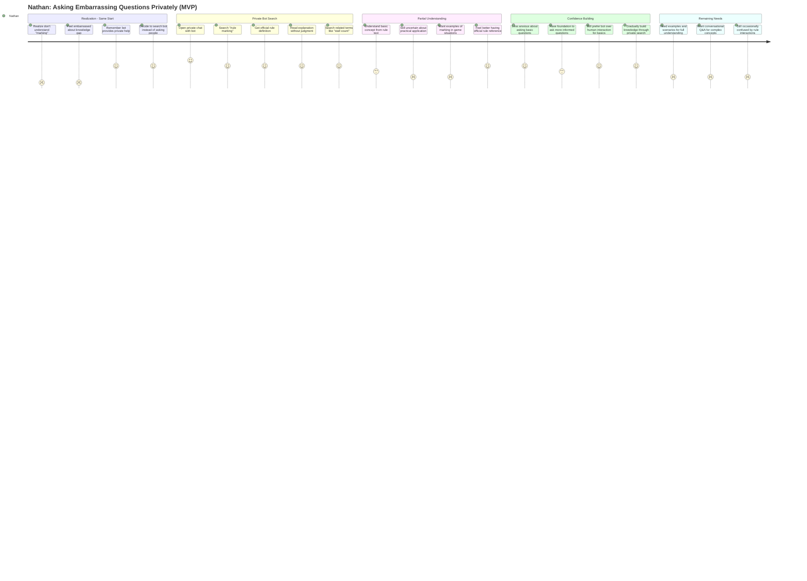
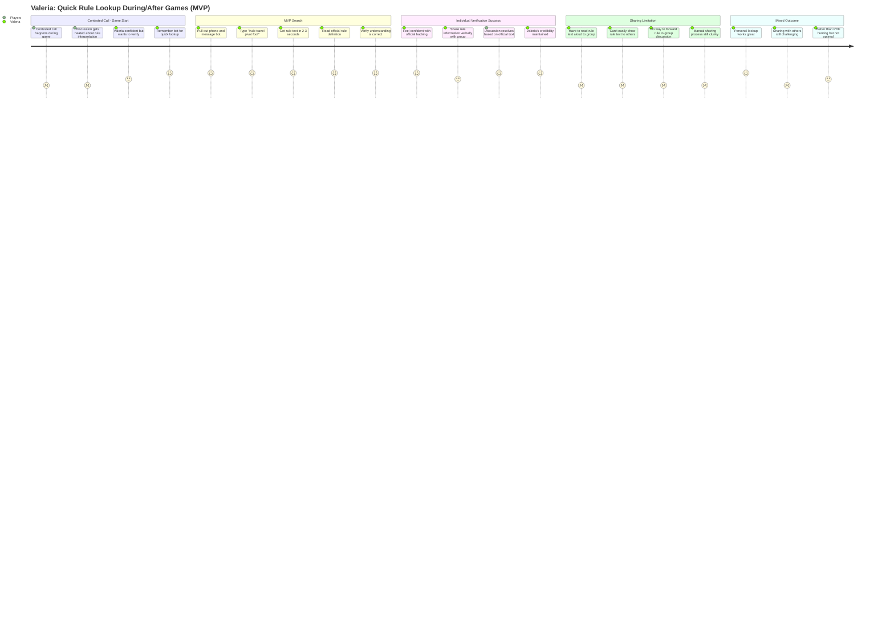
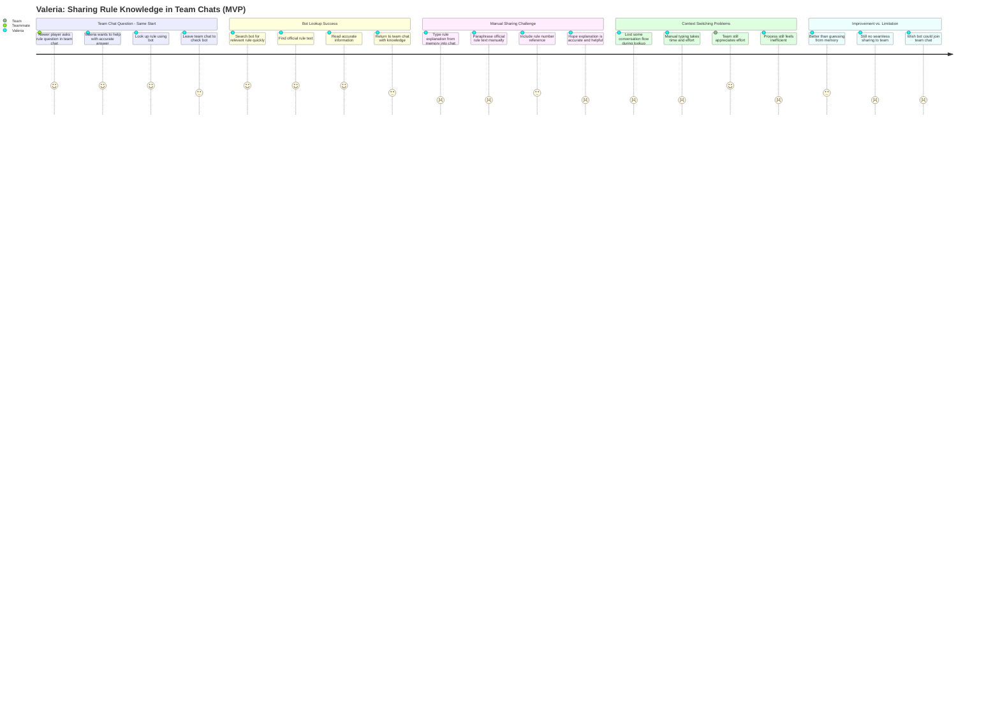
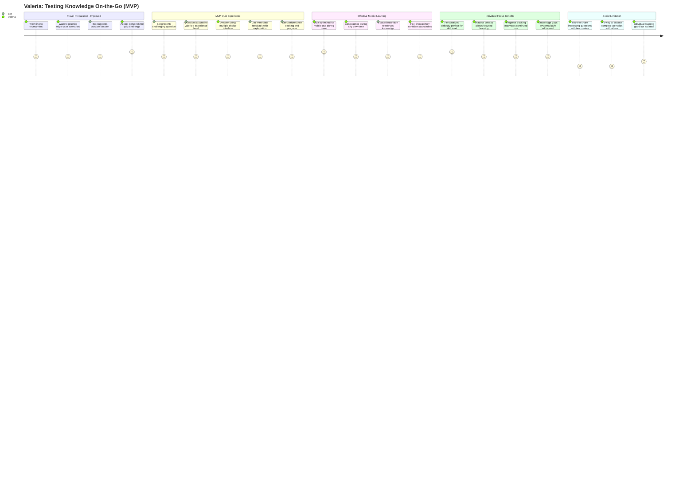
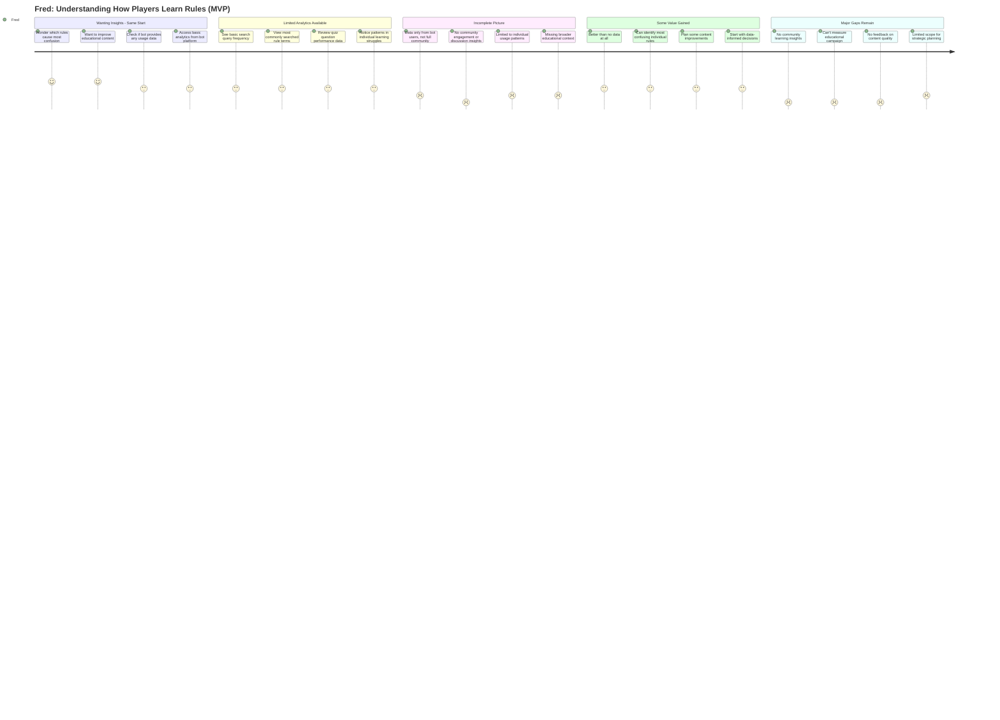
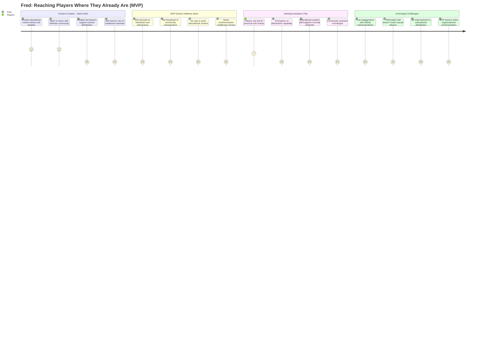
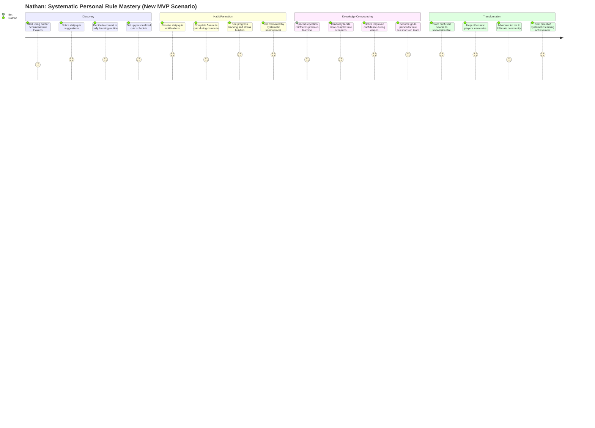
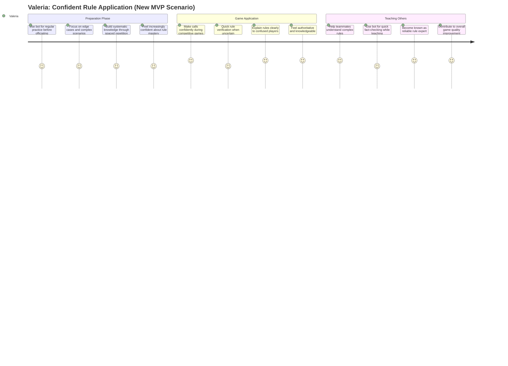
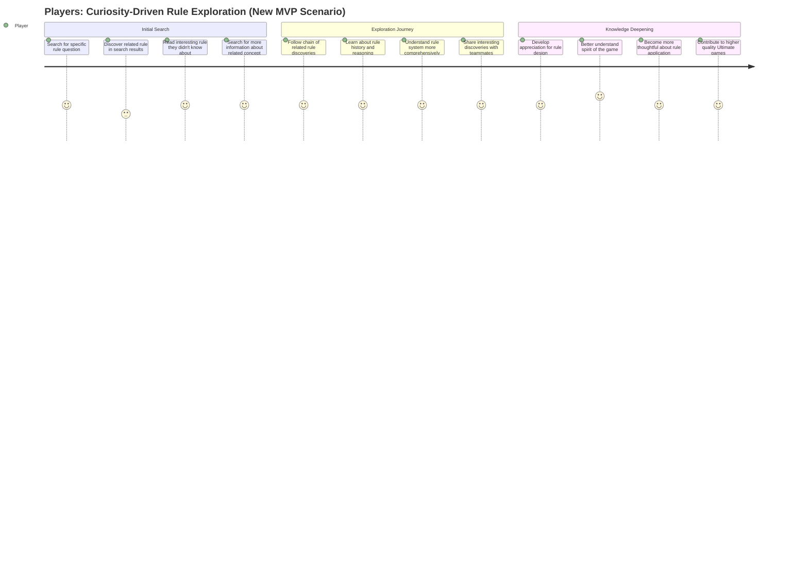

# Telegram Bot MVP Story Map - Realistic Middle Ground

This document shows the realistic user experience with the MVP features (basic rule search + individual tailored quiz). It honestly depicts what improves, what remains challenging, and what new scenarios become possible with these specific features.

**MVP Features**: 
- Basic rule search with keyword matching
- Individual tailored quiz with spaced repetition scheduling
- Private Telegram bot interaction

---

## Original Scenarios - MVP Reality Check

### Nathan (New Player) - Individual Learning Improvements

#### Story 1: Getting Quick Rule Clarification During Pickup

**Context**: Nathan needs quick rule clarification during pickup games when someone mentions terms like "spirit foul" or "bid."

**MVP Reality Check**:
- ✅ **Solves**: Private, quick access to rule text without social embarrassment
- ❌ **Doesn't Solve**: Complex explanations, contextual examples, conversational clarification
- **Satisfaction Improvement**: 1 → 3 (helpful but not complete)
- **Remaining Pain**: Still needs human explanation for nuanced understanding

---

#### Story 2: Learning Rules While Commuting/Traveling

**Context**: Nathan wants to use commute time to learn Ultimate rules systematically.

**MVP Reality Check**:
- ✅ **Solves**: Systematic learning, habit formation, progress tracking, mobile optimization
- ❌ **Doesn't Solve**: Social learning, guided curricula, discussion features
- **Satisfaction Improvement**: 1 → 4 (major improvement with spaced repetition)
- **New Value**: Creates sustainable learning habits that didn't exist before

---

#### Story 3: Asking Embarrassing Questions Privately

**Context**: Nathan realizes he doesn't understand basic concepts but is too embarrassed to ask teammates.

**MVP Reality Check**:
- ✅ **Solves**: Private access eliminates social embarrassment, provides official rule text
- ❌ **Doesn't Solve**: Contextual examples, conversational explanations, complex scenarios
- **Satisfaction Improvement**: 1 → 3 (removes barriers but incomplete understanding)
- **New Value**: Confidence to explore rules privately without social pressure

---

### Valeria (Experienced Player) - Efficiency Gains with Limitations

#### Story 4: Quick Rule Lookup During/After Games

**Context**: Valeria needs to quickly verify edge case rules during heated discussions after contested calls.

**MVP Reality Check**:
- ✅ **Solves**: Fast personal rule verification, maintains credibility, official source
- ❌ **Doesn't Solve**: Easy sharing to groups, team chat integration, collaborative lookup
- **Satisfaction Improvement**: 1 → 3 (personal lookup works, sharing still hard)
- **Remaining Pain**: Group sharing and collaborative verification still problematic

---

#### Story 5: Sharing Rule Knowledge in Team Chats

**Context**: When newer teammates ask rule questions in team group chat, Valeria wants to share accurate rule information quickly.

**MVP Reality Check**:
- ✅ **Solves**: Personal access to accurate rule information quickly
- ❌ **Doesn't Solve**: Team chat integration, direct sharing, seamless collaboration
- **Satisfaction Improvement**: 1 → 2 (slight improvement but core sharing problem remains)
- **Major Limitation**: Individual-focused MVP doesn't address collaborative use case

---

#### Story 6: Testing Knowledge On-the-Go

**Context**: Valeria wants to test her edge case rule knowledge while traveling to tournaments.

**MVP Reality Check**:
- ✅ **Solves**: Mobile-optimized practice, personalized difficulty, progress tracking, systematic improvement
- ❌ **Doesn't Solve**: Social sharing, collaborative learning, discussion features
- **Satisfaction Improvement**: 1 → 4 (major improvement for individual practice)
- **Sweet Spot**: Individual quiz perfectly suited for MVP scope and Valeria's personal needs

---

### Fred (Federation Coordinator) - Limited Organizational Benefits

#### Story 7: Understanding How Players Learn Rules

**Context**: Fred wants to understand which rules players find confusing to improve educational content.

**MVP Reality Check**:
- ✅ **Solves**: Basic individual usage analytics, rule confusion identification
- ❌ **Doesn't Solve**: Community insights, educational campaign measurement, broad feedback
- **Satisfaction Improvement**: 1 → 2 (some data better than none, but very limited)
- **Scope Limitation**: MVP individual focus provides minimal organizational value

---

#### Story 8: Reaching Players Where They Already Are

**Context**: Fred wants to distribute educational content to the Ultimate community.

**MVP Reality Check**:
- ✅ **Solves**: Nothing - MVP individual focus doesn't address content distribution
- ❌ **Doesn't Solve**: Community outreach, content broadcasting, engagement improvement
- **Satisfaction Improvement**: 1 → 1 (no improvement - MVP doesn't address this need)
- **Clear Gap**: Organizational features completely outside MVP scope

---

#### Story 9: Distributing Educational Content at Scale

**Context**: When new rule interpretations come out, Fred needs to educate the community quickly.

**MVP Reality Check**:
- ✅ **Solves**: Individual players can search for updated rules if they know to look
- ❌ **Doesn't Solve**: Proactive content distribution, community education campaigns, emergency communication
- **Satisfaction Improvement**: 1 → 1 (essentially no improvement for Fred's needs)
- **Wrong Tool**: MVP individual features don't address organizational distribution needs

---

## New Scenarios Enabled by MVP

### Scenario A: Systematic Personal Rule Mastery

**Context**: Nathan develops comprehensive rule knowledge through consistent individual practice.

**New Value**: Spaced repetition creates sustainable learning habit that transforms rule knowledge comprehensively.

---

### Scenario B: Confident Rule Application

**Context**: Valeria uses regular quiz practice to build confidence for officiating and teaching.

**New Value**: Systematic practice creates confidence and expertise that benefits broader community.

---

### Scenario C: Curiosity-Driven Rule Exploration

**Context**: Players discover interesting rules through search that they never would have found in PDFs.

**New Value**: Searchable access enables serendipitous learning and deeper rule system understanding.

---

## MVP Limitations - Honest Assessment

### Community Features Completely Missing
- **No team chat integration** - sharing knowledge requires manual copying
- **No weekly quiz or group challenges** - no community engagement features
- **No social learning or discussion** - isolated individual experience only
- **No federation content management** - organizational needs completely unaddressed

### Search Limitations
- **Basic keyword matching only** - no semantic understanding or conversational queries
- **No contextual examples** - just rule text without practical application scenarios
- **No cross-referencing** - limited discovery of related rules
- **No natural language queries** - must know specific terms to search effectively

### Individual Quiz Constraints
- **Multiple choice format only** - no scenario-based or practical application questions
- **Limited content variety** - depends on existing quiz database scope
- **No social features** - can't share interesting questions or compete with others
- **Basic adaptation** - simple spaced repetition, not sophisticated AI personalization

### Analytics and Insights
- **Individual usage only** - no community or educational campaign analytics
- **Basic metrics** - search frequency and quiz performance, nothing sophisticated
- **No federation insights** - can't help Fred understand broader learning patterns
- **Privacy limitations** - individual focus means limited organizational value

---

## MVP Value Summary

### What MVP Delivers Well
✅ **Individual Rule Access**: Transforms impossible PDF hunting into quick, reliable lookup
✅ **Personal Learning Habits**: Spaced repetition creates sustainable knowledge building
✅ **Privacy and Confidence**: Eliminates social barriers to learning basic concepts
✅ **Mobile Optimization**: Works seamlessly in mobile contexts where web interface fails
✅ **Immediate Value**: Solves core access problems without community complexity

### What MVP Doesn't Deliver
❌ **Community Features**: No social learning, team integration, or group engagement
❌ **Advanced AI**: No conversational Q&A, complex scenario interpretation, or natural language
❌ **Organizational Tools**: No content distribution, analytics, or federation management
❌ **Collaborative Learning**: Individual focus means no knowledge sharing or social amplification

### Realistic Positioning
The MVP creates a **solid foundation for individual learning** while preserving **clear upgrade paths** to community and AI features. It's not a complete solution, but a valuable first step that validates core value propositions before larger investments.

**Success Metrics**: 
- 500+ daily individual searches (proves access value)
- 200+ users with active quiz habits (proves learning value)
- 70%+ satisfaction with search results (proves basic utility)
- Clear user demand for social features (validates next phase investment)

The MVP honestly addresses individual pain points while acknowledging it doesn't solve community, organizational, or advanced AI needs - setting appropriate expectations for what this investment delivers.