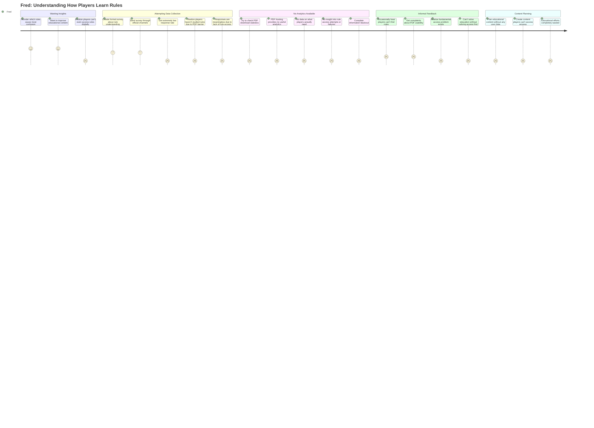
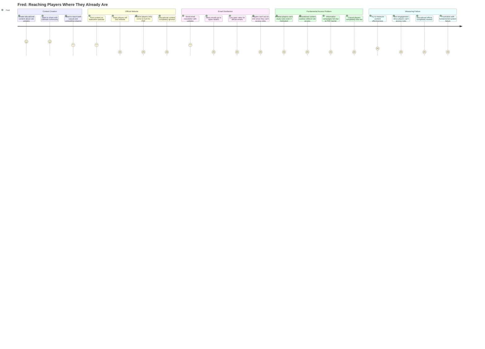

# Telegram Bot Now Map - Current User Journeys

This document maps how users currently attempt to solve Ultimate Frisbee rule-related problems today, when the only available resource is a hard-to-find PDF on federation websites. Each journey shows the harsh reality with satisfaction scores (1=terrible, 5=great), demonstrating why any digital solution would be transformative.

---

## Nathan (New Player) - Current Learning Journeys

### Story 1: Getting Quick Rule Clarification During Pickup

**Context**: Nathan needs quick rule clarification during pickup games when someone mentions terms like "spirit foul" or "bid."

**Key Pain Points**:
- Social embarrassment (score: 1) prevents learning
- Game flow disruption (score: 2) makes asking awkward  
- Post-game PDF hunt completely fails (score: 1) - can't find PDF, can't search it, completely unusable on mobile
- Players remain confused and make future mistakes due to lack of accessible rule clarification

---

### Story 2: Learning Rules While Commuting/Traveling

**Context**: Nathan wants to use commute time to learn Ultimate rules but there's no practical way to access or study rules on mobile.

**Key Pain Points**:
- No way to find current, official rules PDF easily (score: 1)
- PDF completely unusable on mobile (score: 1) - terrible zoom, navigation, reading experience
- Constantly lose place in PDF when phone locks or app switches (score: 1)
- PDF so frustrating that learning becomes impossible (score: 1)
- Players give up on rule education entirely due to access barriers

---

### Story 3: Asking Embarrassing Questions Privately

**Context**: Nathan realizes he doesn't understand basic concepts after playing for weeks but is too embarrassed to ask teammates.

**Key Pain Points**:
- Social embarrassment (score: 1) creates learning barriers
- Online search gives Reddit opinions, not official rules (score: 1-2)
- Official rules PDF impossible to search or use for specific questions (score: 1)
- No authoritative, accessible source exists for rule clarification
- Even experienced players can't quickly access official rule text to help
- Knowledge gaps persist and compound because official rule verification is impossible

---

## Valeria (Experienced Player) - Current Speed & Context Journeys

### Story 4: Quick Rule Lookup During/After Games

**Context**: Valeria needs to quickly verify edge case rules during heated discussions after contested calls.

**Key Pain Points**:
- PDF hunt completely impossible (score: 1) during heated discussions
- Mobile PDF experience completely unusable (score: 1) under pressure
- No way to quickly find specific rule sections in PDF
- Players lose all confidence in rule verification capability
- Disputes remain unresolved due to inability to access authoritative source

---

### Story 5: Sharing Rule Knowledge in Team Chats

**Context**: When newer teammates ask rule questions in team group chat, Valeria wants to share accurate rule information quickly.

**Key Pain Points**:
- PDF hunt completely breaks conversation flow (score: 1)
- Impossible to find and share specific rule text quickly (score: 1)
- Forced to provide uncertain answers from memory (score: 1)
- Team loses confidence in rule guidance due to inability to verify
- Valeria's expertise undermined by lack of accessible authoritative source

---

### Story 6: Testing Knowledge On-the-Go

**Context**: Valeria wants to test her edge case rule knowledge while traveling to tournaments but there's no quiz system available anywhere.

**Key Pain Points**:
- No quiz or testing system exists anywhere (score: 1)
- PDF completely unusable for studying edge cases on mobile (score: 1)
- Can't search for specific scenarios or rule interactions (score: 1)
- No way to test understanding or verify knowledge (score: 1)
- Mobile PDF so frustrating that study becomes impossible (score: 1)
- Players arrive at tournaments unprepared due to inability to practice

---

## Fred (Federation Coordinator) - Current Monitoring & Reach Journeys

### Story 7: Understanding How Players Learn Rules

**Context**: Fred wants to understand which rules players find confusing but has no way to gather learning data since there's no accessible digital platform.

**Key Pain Points**:
- No digital platform means zero learning analytics available (score: 1)
- Survey responses meaningless because players can't access rules to study (score: 1)
- Complete information blackout about player rule access needs (score: 1)
- Educational content planning impossible without understanding user behavior (score: 1)
- Fundamental access problem must be solved before education can happen

---

### Story 8: Reaching Players Where They Already Are

**Context**: Fred wants to distribute educational content to the Ultimate community but relies on channels with low engagement.

**Key Pain Points**:
- Educational content meaningless when players can't access rules (score: 1)
- PDF access barrier makes all educational efforts ineffective (score: 1)
- Communication campaigns fail because underlying access problem unsolved (score: 1)
- Zero engagement metrics since platform doesn't support user interaction (score: 1)
- Educational mission completely blocked by fundamental access issues

---

### Story 9: Distributing Educational Content at Scale

**Context**: When new rule interpretations come out, Fred needs to educate the community quickly but relies on slow, formal channels.

**Key Pain Points**:
- Updated PDFs can't be pushed to users who need them (score: 1)
- Players continue using outdated rule versions unknowingly (score: 1)
- No way to rapidly distribute emergency rule clarifications (score: 1)
- Educational campaigns completely fail due to fundamental access barriers (score: 1)
- PDF distribution system makes urgent rule communication impossible

---

## Summary of Pain Points by Category

### Fundamental Access Barriers
- Rules PDF nearly impossible to find through search or website navigation (All Stories)
- Mobile PDF experience completely unusable - no search, terrible zoom/scroll, constantly lose place (All Stories)
- No accessible digital platform exists for rule lookup, learning, or reference (All Stories)

### Complete Learning System Failure
- Players give up on rule education entirely due to PDF access barriers (Nathan Stories 1, 2, 3)
- No quiz or testing system exists anywhere (Valeria Story 6)
- Educational content meaningless when players can't access underlying rules (Fred Stories 7, 8, 9)

### Real-Time Rule Verification Impossible
- PDF hunt during games/discussions completely impractical (Valeria Stories 4, 5)
- Players forced to argue from faulty memory rather than authoritative sources (All Stories)
- Rule disputes remain unresolved due to inability to verify official text (Valeria Stories 4, 5)

### Social/Professional Impact
- Knowledgeable players lose credibility when they can't access authoritative sources (Valeria Stories 4, 5)
- New players remain confused and make repeated mistakes due to learning barriers (Nathan Stories 1, 2, 3)
- Federation unable to effectively educate community due to fundamental access problems (Fred Stories 7, 8, 9)

### Zero Analytics or Feedback
- No digital platform means zero data about player rule access needs (Fred Story 7)
- Educational campaigns fail with no engagement metrics or user behavior insights (Fred Stories 8, 9)
- Impossible to measure effectiveness of rule education efforts (Fred Stories 7, 8, 9)

### Emergency Communication Failures
- Critical rule updates can't reach players who need them (Fred Story 9)
- Players unknowingly use outdated rule versions (Fred Stories 8, 9)
- No way to rapidly distribute emergency rule clarifications (Fred Story 9)

These pain points represent a complete system failure in rule access and education. A Telegram bot wouldn't just be an incremental improvement - it would be the **first practical digital solution** to fundamental problems that currently have no viable workaround. The value proposition is transformational rather than competitive.