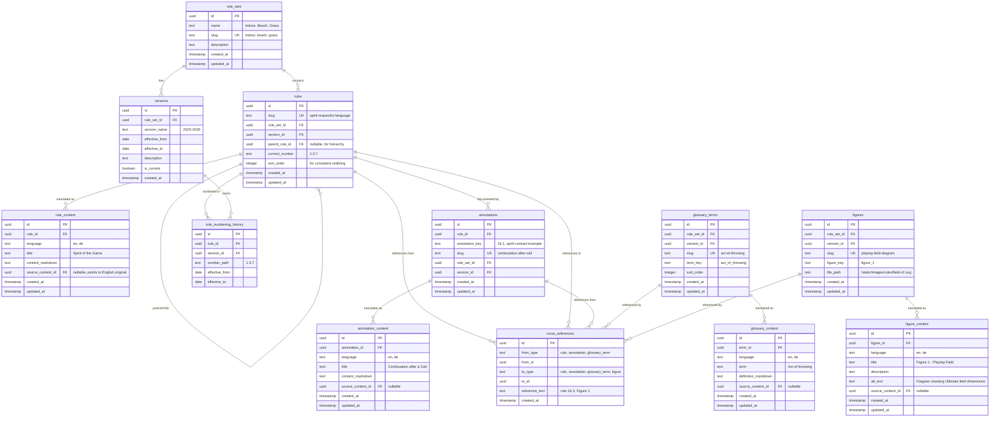

# Database Schema

## Overview

Normalized schema for storing Ultimate Frisbee rules with version-stable identifiers, multi-language support, and cross-referencing.

## Entity Relationship Diagram

